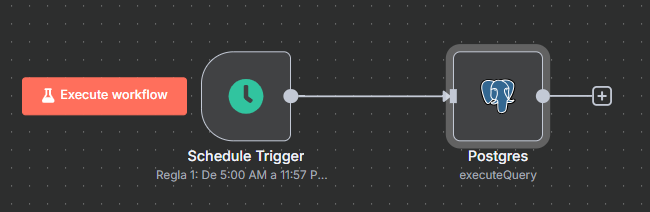
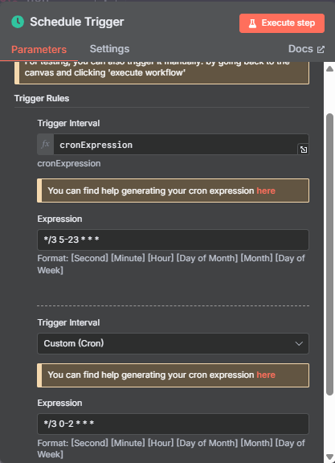
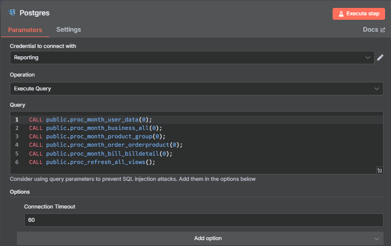

# Proyecto 2 — Orquestación (cron → n8n)

[← Volver al inicio](../index.md)

## 🎯 Objetivo
Reemplazar múltiples cron por **n8n** con trazabilidad, reintentos y notificaciones.

## 🔁 Antes: cron (ejemplo anon.)

...

*/3 5-23 * * * psql "host=<HOST> dbname=<DB> user=<USER> ..." -f /opt/jobs/proc_month_bill_billdetail.sql >> /var/log/etl.log 2>&1

## ⚙️ Después: n8n
- Trigger (cron) cada 1–3 minutos (05:00–23:57).
- Nodo Postgres que ejecuta:

CALL public.proc_month_user_data(0);
CALL public.proc_month_business_all(0);
CALL public.proc_month_product_group(0);
CALL public.proc_month_order_orderproduct(0);
CALL public.proc_month_bill_billdetail(0);
CALL public.proc_refresh_all_views();

## 📸 Capturas
> Sube a `docs/proyecto-2/img/`:
- ``
- ``
- ``

## 📄 Workflow (JSON en repo)
https://github.com/enoelromo/portafolio-bi/blob/main/Proyecto_2_Orquestacion/n8n/workflow_etl.json

...

# Proyecto 2 — Orquestación (cron → n8n)

[← Volver al inicio](../index.md)

## 📸 Capturas

**Flujo n8n**

**Trigger (cron)**

**Nodo Postgres**

