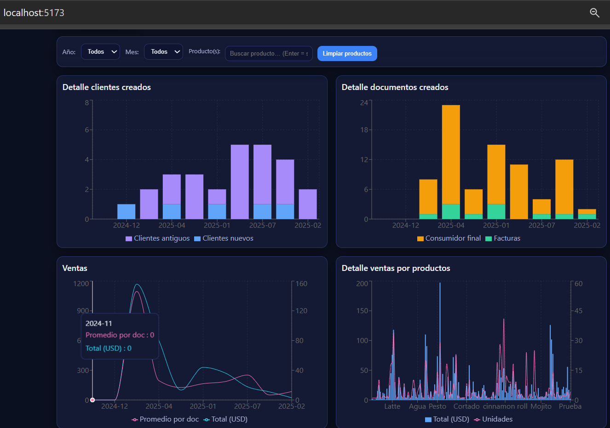
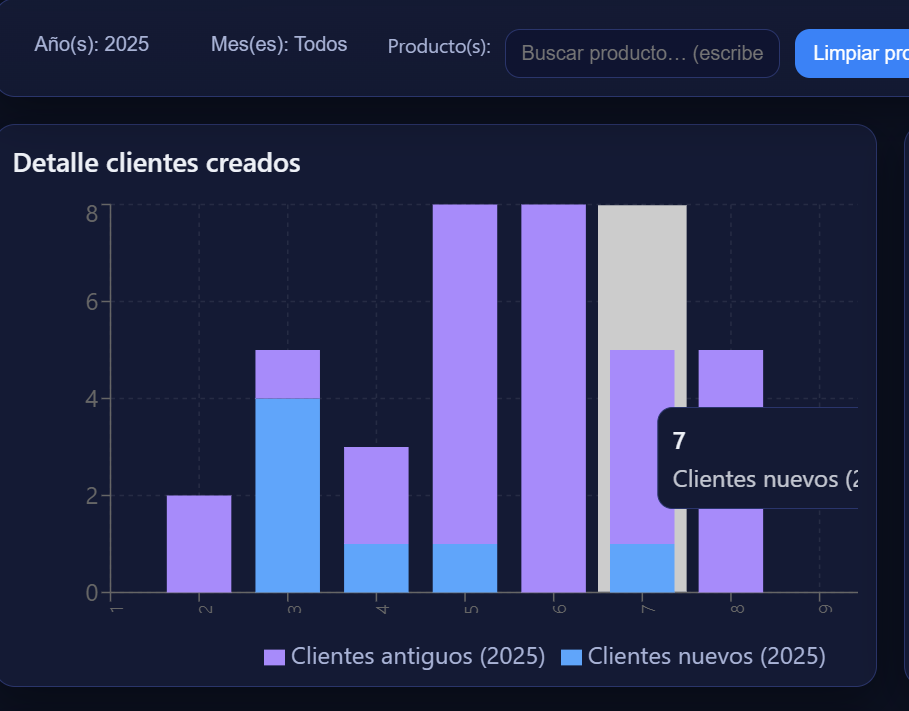
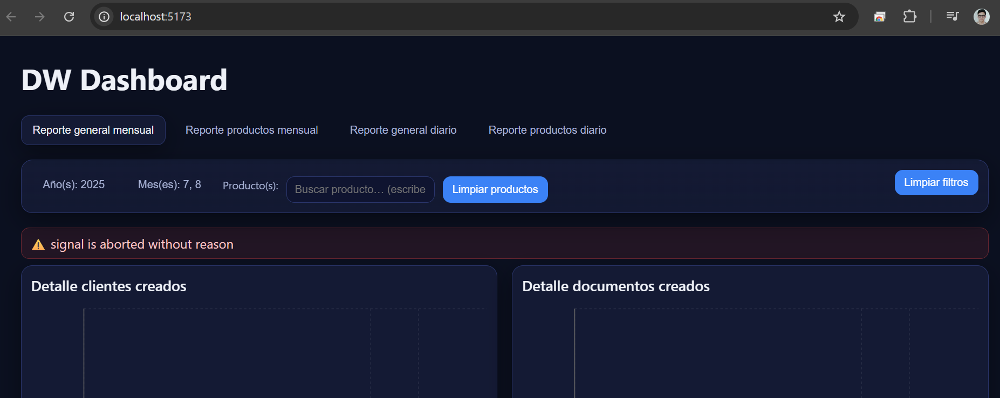

# Proyecto 3 — Dashboard BI

[← Volver al inicio](../index.md)

## 🎯 Resumen
Prototipo de dashboard (dataset anonimizado) para analizar ventas y comportamiento de clientes/productos.
Se alimenta desde el DWH y las **vistas materializadas** de Proyecto 1.

**KPIs clave**
- Ventas totales | Ticket promedio | Nº de transacciones
- Top categorías y productos | Clientes activos/inactivos
- Comparativos día/mes vs. período anterior

---

## 📸 Capturas

### 1) KPI principal

---

### 2) Ventas por categoría

---

### 3) Panel de filtros

---

## ⚙️ Origen de datos (resumen)
- Vistas: `mv_ventas_dia`, `mv_ventas_mes`, `mv_resumen_clientes_dia`, `mv_resumen_clientes_mes`.
- Actualización: por `proc_refresh_all_views()` al final del pipeline (ver Proyecto 2).

## 🔒 Notas de seguridad
Datos y nombres anonimizados (Cliente 001, Producto 001). Sin credenciales ni endpoints reales.

## 🚀 Próximos pasos
- Publicación en Power BI Service/Qlik (área pública) y enlace aquí.
- Parámetros (rango de fechas) y RLS si aplica.
